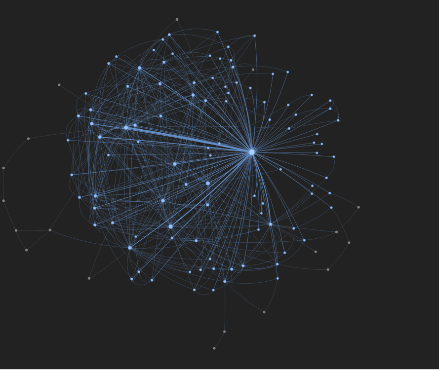
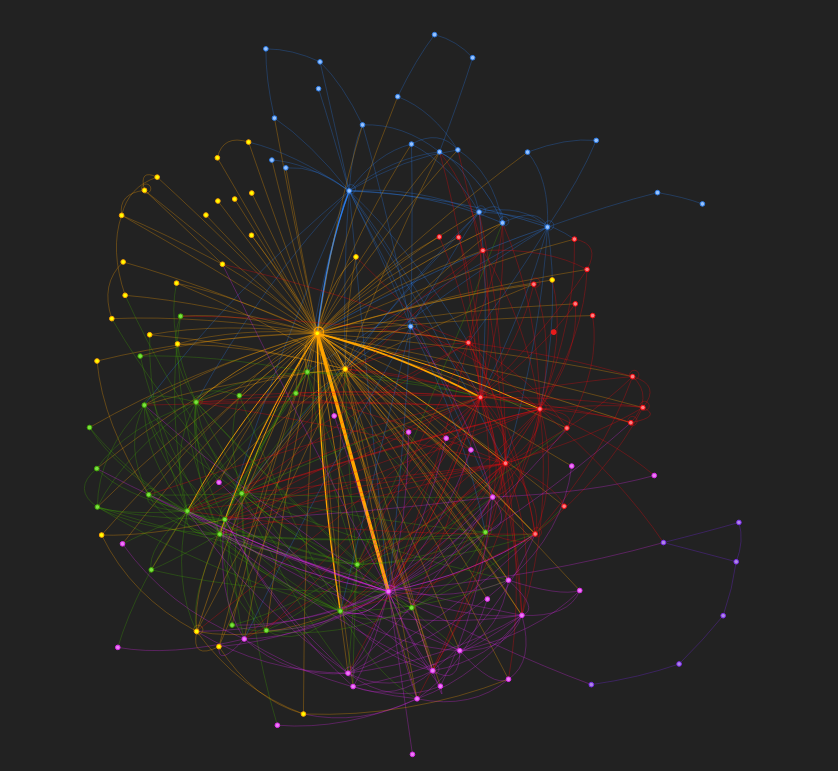

# Analysis of networks in the harry potter universe

# Project Overview
The purpose of this project is to scrape data on the characters in the harry potter books and analyse the relationships and networks between the characters. 

## Methods Used
* Data scraping and colleciton
* Data cleaning
* Data Preparation
* Data visualisation
* Natural language processing
* Network Analysis
* Community Detection
* Graph Analytics

## Codes and Resources Used
- **Editor Used:**  Visual Studio Code
- **Python Version:** 3.11
- **Selenium:** 4.8.3

## Python Packages Used
This section contains all the necessary dependencies needed to reproduce this project

- **Data scraping:** `selenium, webdriver-manager`
- **Data Manipulation:** `pandas`
- **Data Visualization:** `matplotlib` `Networkx` `Pyvis`
- **Natural Language processing:** `spacy.io`


# Data

## Source Data
- **List of harry potter characters:** https://www.hp-lexicon.org/characters/
- **Harry Potter books:** https://github.com/formcept/whiteboard/tree/master/nbviewer/notebooks/data/harrypotter

# Code structure
Explain the code structure and how it is organized, including any significant files and their purposes. This will help others understand how to navigate your project and find specific components. 

Here is the basic suggested skeleton for your data science repo (you can structure your repository as needed ):

```bash
├── LICENSE
├── README.md    
├── cover.gif  
├── data
│   ├── external       
│   ├── interim       
│   ├── processed      
│   └── raw                    
│
├── notebooks    
│   ├── character_scraping.ipynb    
│   ├── character_relations_data.ipynb    
│   └── visualization.ipynb                    
│
│
├── reports            
│   │── figures   
│   │   ├── Networks
│   │   ├── Communities
│   │   └── Screenshots
│   └── Harry Potter Network report    
│
├── requirements.txt  
├── src                
│   ├── __init__.py    
│   │
│   ├── data           
│   │   ├── make_dataset.py
│   │   ├── extract_relationships.py  
│   │   ├── scrape_characters.py
│   │   └── functions.py
│   │
│   └── visualization  
│       └── visualize.py
```

# Results and evaluation
## Important Characters
The most important characters were measured by three metrics, degree centrality, closeness centrality and betweenness centrality. Harry, Ron, Hermoine and Dumbledore were consistently the most important characters across allt he 7 books.
 ### Degree Centrality


### Closeness Centrality


### Betweenness Centrality


## Evolution of the importance of some characters across the 7 books


## Network Map of the characters in the Harry Potter and the Philosophers Stone


## Community detection with interactions from Harry Potter and the Philosophers Stone


### 📘 **Detailed maps for each of the 7 books can be found in the reports folder**
# Future work
Our analysis represents only the tip of the iceberg of possibilities for applying data science to deep and meaningful literary analysis.

# Acknowledgments/References
* Idea by [Thu Vu](https://github.com/thu-vu92/the_witcher_network)
* Cover Image by [DWLAwesome](https://raw.githubusercontent.com/DLWAwesome/harry-potter-spells/master/2005874_200x130.gif)


# License
Specify the license under which your code is released. Moreover, provide the licenses associated with the dataset you are using. This is important for others to know if they want to use or contribute to your project. 

For this github repository, the License used is [MIT License](https://opensource.org/license/mit/).